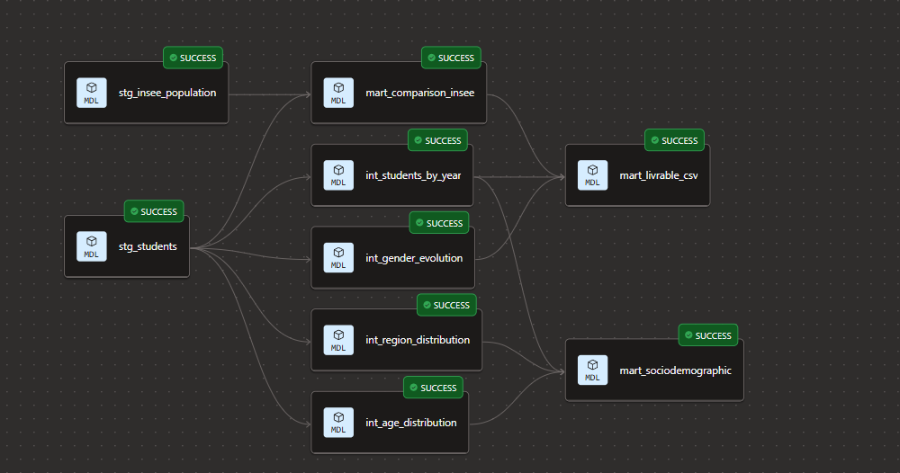

# Projet P8 — Analyse sociodémographique des étudiants Data OC

Analyse de l'évolution du profil sociodémographique des étudiants des parcours Data d'OpenClassrooms (2022-2025), comparé à la population française (INSEE).

## Objectif

Produire des indicateurs exploitables pour la direction pédagogique sur 3 dimensions : genre, âge, géographie. Les données OC sont contextualisées avec les estimations de population INSEE 2023 pour mesurer les écarts (surreprésentation IDF, déficit de parité, profil reconversion).

## Stack technique

- **Snowflake** — entrepôt de données (base OC_P8)
- **dbt Cloud** — transformations SQL, tests, documentation
- **GitHub** — versioning du code
- **Python (openpyxl)** — prétraitement du fichier Excel INSEE avant chargement
- **INSEE** — données externes de population (open data)

## Sources de données

| Source | Table Snowflake | Description |
|--------|----------------|-------------|
| OpenClassrooms | `OC_P8.RAW.STUDENTS` | 4647 inscriptions, 6 variables, 2022-2025 |
| INSEE | `OC_P8.RAW_INSEE.POPULATION_REGION` | Population par région, sexe, âge quinquennal (2022-2025) |

Les données sources ne sont pas incluses dans le repo (confidentialité OC + volume INSEE). Voir `data/README.md` pour les instructions d'obtention.

## Prétraitement INSEE

Le fichier Excel INSEE a un format complexe (52 onglets, en-têtes multi-niveaux, cellules fusionnées). Le script `scripts/convert_insee_xlsx_to_csv.py` le transforme en CSV tabulaire plat avant chargement dans Snowflake :
```bash
pip install openpyxl
python scripts/convert_insee_xlsx_to_csv.py
```

Produit `insee_population_region.csv` → chargé dans `OC_P8.RAW_INSEE.POPULATION_REGION` via Snowflake Load Data. Voir `scripts/load_data_snowflake.sql` pour les commandes de chargement.

## Architecture du pipeline


```
Sources (RAW)          Staging (stg_)         Intermediate (int_)       Marts
─────────────          ──────────────         ───────────────────       ─────
STUDENTS          →    stg_students      →    int_students_by_year  →  mart_sociodemographic
                                         →    int_gender_evolution  →  mart_livrable_csv
                                         →    int_age_distribution
                                         →    int_region_distribution
POPULATION_REGION →    stg_insee_population ─────────────────────────→ mart_comparison_insee
                                                                   →  mart_livrable_csv
```

Le pipeline suit l'architecture dbt en 3 couches : le staging nettoie et harmonise les données brutes, les intermédiaires calculent les indicateurs par dimension, et les marts assemblent les résultats pour la direction et l'export CSV.

## Modèles

| Couche | Modèle | Rôle | Matérialisation |
|--------|--------|------|-----------------|
| staging | `stg_students` | Nettoyage : TRIM, genre vide → 'Non renseigné' (RGPD art. 9), filtre USER_ID NULL | view |
| staging | `stg_insee_population` | Harmonisation : régions (Centre-Val-de-Loire, DROM), sexe (M/F/Ensemble), regroupement 60+, exclusion <20 ans | view |
| intermediate | `int_students_by_year` | Effectifs, étudiants distincts, répartition genre, taux NR, % femmes parmi répondants → slide 8 | view |
| intermediate | `int_gender_evolution` | Évolution M/F/NR par année en format long → slide 9 | view |
| intermediate | `int_age_distribution` | Distribution âge par année, rang, âge moyen estimé → slide 11 + backup oral | view |
| intermediate | `int_region_distribution` | Répartition géographique par année, rang, zone IDF/Province → slide 13 + backup oral | view |
| mart | `mart_comparison_insee` | Croisement OC global vs INSEE 2023 sur 3 dimensions (UNION ALL) → slides 10, 12, 14 | table |
| mart | `mart_sociodemographic` | Synthèse annuelle : joint les 4 intermédiaires, aucun recalcul | table |
| mart | `mart_livrable_csv` | Export consolidé : 7 blocs étiquetés par slide, colonnes polymorphes, UNION ALL | table |

## Choix méthodologiques

| Choix | Justification |
|-------|---------------|
| Genre vide → 'Non renseigné' | RGPD art. 9 : pas d'imputation d'une donnée sensible. Respect du droit de non-réponse. Le taux de NR (42%→7%) devient un indicateur de qualité. |
| 568 doublons = réinscriptions | Analyse : USER_ID × année est unique (vérifié par test). Un étudiant inscrit en 2022 et 2024 = 2 lignes légitimes. |
| INSEE 2023 uniquement | Dernières données définitives. 2024-2025 = estimations provisoires. Structure démographique stable d'une année à l'autre. |
| Regroupement 60+ | Les 8 tranches INSEE ≥60 ans n'ont pas d'équivalent OC. Regroupées en une seule catégorie. Point milieu codé à 65 pour l'âge moyen (arbitraire, impact faible : 1,6% du dataset). |
| Regroupement DROM | Les 5 DROM + DOM regroupés en un seul "DROM" pour correspondre aux données OC. |
| Staging direct pour le mart INSEE | Les intermédiaires sont par année, la comparaison INSEE est globale. Passer par les intermédiaires ajouterait une agrégation inutile. |
| % femmes excluant NR | Dénominateur = M+F. Inclure les NR diluerait le ratio à ~23% au lieu de 31%. Le taux de NR est traité séparément comme indicateur de collecte. |

## Tests

8 tests automatisés, exécutés à chaque `dbt build` :

| Test | Type | Ce qu'il vérifie |
|------|------|-----------------|
| `not_null (USER_ID)` | YAML | Aucune ligne sans identifiant |
| `not_null (gender)` | YAML | Plus de NULL après nettoyage staging |
| `accepted_values (gender)` | YAML | Uniquement M, F, Non renseigné |
| `accepted_values (year)` | YAML | Années 2022-2025 uniquement |
| `assert_unique_student_year` | Custom SQL | Unicité USER_ID + année (confirme les 568 réinscriptions) |
| `assert_percentages_sum_100` | Custom SQL | Somme des % âge = 100% par année (tolérance 99-101 pour arrondis) |
| `assert_region_pct_sum_100` | Custom SQL | Somme des % régions = 100% par année |
| `assert_no_future_years` | Custom SQL | Pas d'année hors plage 2022-2025 |

Tous les tests passent au vert. Si une incohérence apparaît après un nouveau chargement de données, le pipeline échoue AVANT de produire des résultats erronés.

## Conformité RGPD

- **Pseudonymisation** : USER_ID hashé en amont par OC, aucune tentative de ré-identification
- **Donnée sensible** : genre traité au titre de l'art. 9 RGPD, finalité égalité des chances, usage statistique agrégé uniquement
- **Pas d'imputation** : les genres vides restent 'Non renseigné' (droit de non-réponse)
- **Minimisation** : 6 colonnes, tranches d'âge (pas l'âge exact), régions (pas d'adresse ni département)
- **Résultats agrégés** : aucune donnée individuelle en sortie des marts
- **INSEE** : données publiques open data, aucune donnée personnelle

## Exécution
```bash
# 1. Exécuter le pipeline complet (modèles + tests)
dbt build

# 2. Générer la documentation et le lineage
dbt docs generate

# 3. Modèles seuls
dbt run

# 4. Tests seuls
dbt test
```

## Export des livrables CSV

Dans Snowflake (Snowsight), exécuter puis Download → CSV :
```sql
-- CSV staging (données nettoyées individuelles, 4647 lignes)
SELECT * FROM OC_P8.DBT_CLIPPENS.STG_STUDENTS
ORDER BY year_started, region, age_group, gender;

-- CSV mart (indicateurs agrégés par slide, ~66 lignes)
SELECT * FROM OC_P8.DBT_CLIPPENS.MART_LIVRABLE_CSV
ORDER BY slide, rang;
```

Le CSV mart contient 7 blocs identifiés par `source_table` :

| Bloc | Slide | Contenu |
|------|-------|---------|
| `S08_effectifs_par_annee` | 8 | Inscriptions par année |
| `S09_parite_homme_femme` | 9 | Répartition M/F/NR par année |
| `S10_distribution_age` | 10 | Distribution âge global + comparaison INSEE |
| `S11_evolution_age_top5` | 11 | Évolution top 5 tranches d'âge par année |
| `S12_repartition_geographique` | 12 | Répartition géographique global + comparaison INSEE |
| `S13_evolution_pct_idf` | 13 | Évolution % IDF par année |
| `S14_S16_comparaison_insee_synthese` | 14 | 3 lignes clés OC vs INSEE (genre, âge 25-39, IDF) |

## Structure du repo
```
models/
  staging/
    stg_students.sql                  # Nettoyage données OC
    stg_insee_population.sql          # Harmonisation données INSEE
    _staging__sources.yml             # Déclaration + tests des sources
    _staging__models.yml              # Documentation + tests du staging
  intermediate/
    int_students_by_year.sql          # Effectifs par année
    int_gender_evolution.sql          # Évolution genre par année
    int_age_distribution.sql          # Distribution âge par année
    int_region_distribution.sql       # Répartition géo par année
    _intermediate__models.yml         # Documentation + tests
  marts/
    mart_comparison_insee.sql         # Croisement OC vs INSEE
    mart_sociodemographic.sql         # Synthèse annuelle
    mart_livrable_csv.sql             # Export CSV (7 blocs)
    _marts__models.yml                # Documentation + tests
tests/
  assert_unique_student_year.sql      # Unicité USER_ID + année
  assert_percentages_sum_100.sql      # Somme % âge = 100
  assert_region_pct_sum_100.sql       # Somme % régions = 100
  assert_no_future_years.sql          # Années dans la plage
scripts/
  convert_insee_xlsx_to_csv.py        # Prétraitement Excel INSEE → CSV
  load_data_snowflake.sql             # Création schémas + chargement
  requetes_verification_snowflake.sql # Vérification par slide + exports
data/
  README.md                           # Instructions pour obtenir les données sources
docs/
  lineage_dag.png                     # Capture du DAG dbt
dbt_project.yml
README.md
```